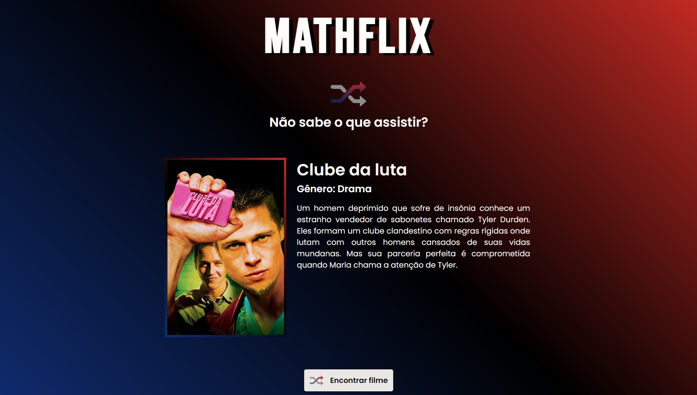

<h1 align="center">
  
  MATHFLIX
  
</h1>

  

<h2>📽️ Sobre</h2>

Mathflix é um site para ajudar as pessoas a decidirem qual filme assistir. Cada vez que o usuário clica no botão de Encontrar, um filme com algumas informações como gênero e sinopse será mostrado. Atualmente, o site possui mais de 1600 filmes em seu catálogo.

 
<h2>🎯 Objetivo</h2>

Principal objetivo ao desenvolver o Mathflix foi aplicar na prática os conhecimentos obtidos na "linguagem" Typescript, deixando o código consistente e fácil de dar manutenção. Além disso, pude aprender a como construir o projeto usando a ferramenta Vite, que facilita a crição de projetos, eliminando a necessidade de utilizar os Bundlers para gerenciar frameworks e compiladores, entre outras vantagens.

 
<h2>🚀 Tecnologias e ferramentas utilizadas</h2>
<ul>
  <li>HTML</li>
  <li>CSS</li>
  <li>Typescript</li>
  <li>Vite</li>
</ul>
 
<h2>🏷️ Layout</h2>

Você pode visualizar o layout do projeto através deste link: <a href="https://www.figma.com/file/SX8XFyC5fAY09ai8Oykz0T/DD-%2F-Login-Form---CSS/duplicate">Layout do projeto</a>. É necessário possuir uma conta no <a href="https://figma.com">Figma</a> para acessá-lo.

 
 

Made by Matheus Pazinati 🛸
